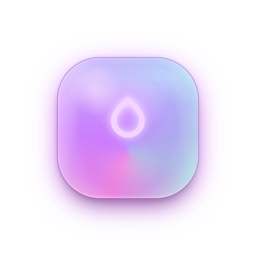
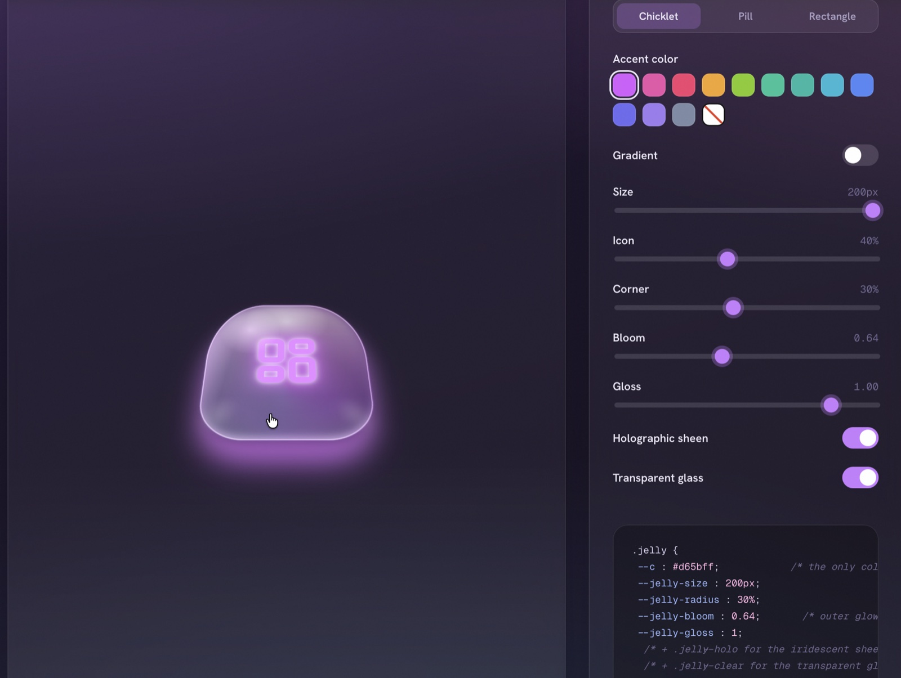

# @inova.dev/jelly-ui

<p align="center">
  
</p>

[](https://www.npmjs.com/package/@inova.dev/jelly-ui)
[](https://www.npmjs.com/package/@inova.dev/jelly-ui)
[](https://www.npmjs.com/package/@inova.dev/jelly-ui)
[](./LICENSE)

📦 **npm:** [`@inova.dev/jelly-ui`](https://www.npmjs.com/package/@inova.dev/jelly-ui) &nbsp;·&nbsp; ▶ **Playground:** [jelly-ui.vercel.app](https://jelly-ui.vercel.app/)

A glowing **3D-jelly + liquid-glass** icon-button material for React. Each button
is driven by a single accent colour (`color` → CSS `--c`); everything else — the
emissive core, the deep subsurface shade, the bloom, the gloss, the rim light —
is derived from it. Includes frosted-glass (`clear`), holographic (`holo`), and
colourless white-glass (`neutral`) variants, plus a cursor-tracking specular
highlight and a springy press bounce.

## Preview

<p align="center">
  <a href="https://pub-fc716af3e09a4179bf481fa2d68e1f10.r2.dev/org/bd390170-1da0-4f68-af70-e7408576c841/media/library/1780695811042-TUwHtgUZ-Jelly_UI_Page.mp4">
    
  </a>
  <br />
  <a href="https://pub-fc716af3e09a4179bf481fa2d68e1f10.r2.dev/org/bd390170-1da0-4f68-af70-e7408576c841/media/library/1780695811042-TUwHtgUZ-Jelly_UI_Page.mp4"><b>▶ Watch the preview</b></a>
</p>

## Install

```bash
npm i @inova.dev/jelly-ui react
```

React **17+** is a peer dependency. Then import the pieces you need — the
components, the optional icon set, and the stylesheet (once, anywhere in your app):

```tsx
import { Jelly, JellyPill } from '@inova.dev/jelly-ui';
import { JellyGlyph, iconColor } from '@inova.dev/jelly-ui/icons';
import '@inova.dev/jelly-ui/styles.css';
```

## Quick start

```tsx
import { Jelly, JellyPill } from '@inova.dev/jelly-ui';
import { JellyGlyph, iconColor } from '@inova.dev/jelly-ui/icons';
import '@inova.dev/jelly-ui/styles.css'; // once, anywhere in your app

export function Toolbar() {
  return (
    <div data-theme="dark">
      <Jelly color="#15c39a" aria-label="Helpful links">
        <JellyGlyph name="links" />
      </Jelly>

      <JellyPill color={iconColor('blog')} icon={<JellyGlyph name="blog" />}>
        Write a post
      </JellyPill>
    </div>
  );
}
```

> **Next.js / RSC:** the components use refs and pointer handlers, so render them
> inside a Client Component (a file with `'use client'`).

## Components

### `<Jelly>` — icon-only "chicklet"

Pass an `<svg viewBox="0 0 24 24">` as children (use `<JellyGlyph>` or your own
lucide-style glyph). Always give it an `aria-label`.

```tsx
<Jelly color="#d65bff" size={56} aria-label="Dashboard">
  <JellyGlyph name="dashboard" />
</Jelly>
```

### `<JellyPill>` — labelled button

```tsx
<JellyPill color="#4f86f7" shape="rect" icon={<JellyGlyph name="files" />}>
  Files & media
</JellyPill>
```

## Props

Both components accept all native `<button>` attributes plus the material knobs
below (each maps to a CSS custom property, so anything not listed can still be
set via `style`):

| Prop            | Type                    | CSS var               | Notes |
| --------------- | ----------------------- | --------------------- | ----- |
| `color`         | `string`                | `--c`                 | The one knob the whole look derives from. |
| `color2`        | `string`                | `--c2`                | Second gradient stop (turns the gradient on). |
| `gradient`      | `boolean`               | `--grad`              | Force gradient on/off (default: on when `color2` is set). |
| `gradientAngle` | `number` (deg)          | `--grad-angle`        | Default `120`. |
| `size`          | `number \| string`      | `--jelly-size`        | A number means pixels. |
| `radius`        | `number \| string`      | `--jelly-radius`      | Chicklet only (pill/rect keep their shape). |
| `bloom`         | `number`                | `--jelly-bloom`       | Outer glow strength. |
| `gloss`         | `number`                | `--jelly-gloss`       | Surface gloss strength. |
| `iconScale`     | `number`                | `--jelly-icon-scale`  | 0–1. |
| `holo`          | `boolean`               | `.jelly--holo`        | Iridescent conic sheen. |
| `clear`         | `boolean`               | `.jelly--clear`       | Transparent liquid glass. |
| `neutral`       | `boolean`               | `.jelly--neutral`     | Colourless white glass (ignores `color`). |
| `active`        | `boolean`               | `.is-active`          | Selected state — pumped glow. |
| `interactive`   | `boolean`               | —                     | Cursor-light + release bounce. Default `true`. |
| `shape`         | `'pill' \| 'rect'`      | —                     | `<JellyPill>` only. |

## Theming

Put `data-theme="light"` or `data-theme="dark"` on any ancestor:

- **dark** — neon, lit-from-within (the studio look)
- **light** — soft frosted candy (for light dashboards)

```tsx
<div data-theme="light">{/* jelly buttons … */}</div>
```

Hovering an ancestor with the class `jelly-host` lights its jelly children too
(useful for nav rows).

## Variants & extras

```tsx
<Jelly color="#9b7cf0" holo aria-label="Brand">…</Jelly>       {/* holographic  */}
<Jelly color="#22b8d6" clear aria-label="Glass">…</Jelly>      {/* liquid glass */}
<Jelly neutral aria-label="Plain glass">…</Jelly>             {/* colourless    */}
<Jelly color="#f43f6e" color2="#f5a524" aria-label="Gradient">…</Jelly> {/* gradient */}
```

`useJellyInteractions(enabled?)` is exported if you want to wire the cursor-light
+ bounce handlers onto your own element. `tintFor()` / `hueOf()` expose the
temperature-matched shadow-ink helper.

## Icons (`@inova.dev/jelly-ui/icons`)

A small lucide-style registry, exported separately so the core stays lean:

```tsx
import { ICONS, iconNames, iconColor, JellyGlyph, type IconName } from '@inova.dev/jelly-ui/icons';
```

`<JellyGlyph name="…" />` renders the glyph as an `<svg>`; `ICONS` is the raw
data (`{ id, label, color, section, path }`). You are not limited to these —
`<Jelly>` accepts any SVG.

## Browser support

Pure CSS, no runtime style deps. Uses modern `color-mix()`, relative colour
syntax and `@property` (current Chrome, Safari, Edge, Firefox). Honours
`prefers-reduced-motion`.

## Development (the lab)

This repo also contains a vanilla showcase/playground used to design the
material — `index.html` + `css/lab.css` + `js/*.js`. The canonical stylesheet
(`css/jelly.css`) is shared by both the lab and the published package.

```bash
python3 -m http.server 5180   # → http://localhost:5180  (the lab)
npm install && npm run build  # → dist/ (the publishable package)
```

`npm run build` runs `tsup` (ESM + CJS + `.d.ts`) and copies/minifies the CSS
into `dist/`.

## License

MIT
